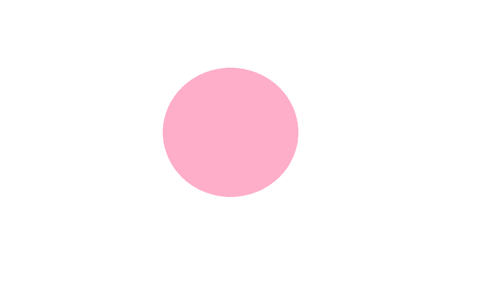

<!-- Main container for left and right columns -->

  <!-- Left side with image and details -->
  

    
    <!-- Contact Links (GitHub, Resume, LinkedIn, Email) -->
      

      <a href="https://github.com/thusharanv" target="_blank">GitHub</a> |
      <a href="https://www.linkedin.com/in/thushara-namath-vadakkemadathil-606a93187" target="_blank">LinkedIn</a> |
      <a href="https://example.com/your-resume.pdf" target="_blank">Resume</a> |
      <a href="mailto:tnv@udel.edu">Email</a>
      

    <h3>About Me</h3>
    

      Enthusiastic and detail-oriented Data Science graduate | Strong foundation in programming, database management, and data analysis | Passionate about transforming complex datasets into actionable insights | Proficient in Python, SQL, and R 
    

  

  
  <!-- Right side with skills and contact information -->
  

    <!-- Education Section under About Me -->
    <h3>Education</h3>
    <ul>
    <li><strong>University of Delaware</strong>, DE, USA</li>
    <li>M.S in Data Science - Feb 2022 – Dec 2024 &nbsp; &nbsp; &nbsp; &nbsp; &nbsp;<strong>GPA: 4.0</strong> </li>
    <li><strong>Chinmaya Institute of Technology</strong>, Kannur University, India</li>
    <li>Master of Computer Applications - Aug 2008 – Nov 2011</li>
    </ul>  
    <h3>Skills & Expertise</h3>
    <ul>
      <li><strong>Programming Languages:</strong> Python, R, SQL, C, C++</li>
      <li><strong>Data Analysis & Visualization:</strong> Pandas, Matplotlib, Seaborn</li>
      <li><strong>Machine Learning:</strong> Scikit-learn, TensorFlow</li>
      <li><strong>Database Management:</strong> PostgreSQL, MySQL</li>
    </ul>
    <h3>Academic Projects</h3>

<!-- Australia Next Day Rain Prediction -->

  <h4>Australia Next Day Rain Prediction</h4>
  
<strong>Tools Used:</strong> Python, Random Forest, Logistic Regression, SMOTE, Pandas, Matplotlib

  
Developed machine learning models to predict next day rainfall using data from Australia. Applied techniques like feature selection and data balancing to improve model performance. Achieved an accuracy of 85% with Random Forest.

  
<strong>GitHub Repository:</strong> <a href="https://github.com/your-project-link" target="_blank">View Code</a>

<!-- Stroke Prediction Using Machine Learning -->

  <h4>Stroke Prediction Using Machine Learning</h4>
  
<strong>Tools Used:</strong> Python, Random Forest, Logistic Regression, PCA, Imbalanced Data Techniques

  
Implemented machine learning algorithms to predict the likelihood of a stroke based on a variety of health metrics. Used techniques such as Principal Component Analysis (PCA) for dimensionality reduction and employed Random Forest as the final model.

  
<strong>GitHub Repository:</strong> <a href="https://github.com/your-project-link" target="_blank">View Code</a>

<!-- Cart Abandonment Prediction -->

  <h4>Cart Abandonment Prediction for E-commerce</h4>
  
<strong>Tools Used:</strong> Python, Naive Bayes, Decision Trees, Pandas, Scikit-learn

  
Analyzed customer behavior data to predict cart abandonment and identify factors influencing purchase decisions. Applied machine learning models to make predictions and suggest solutions for reducing abandonment.

  
<strong>GitHub Repository:</strong> <a href="https://github.com/your-project-link" target="_blank">View Code</a>

  

